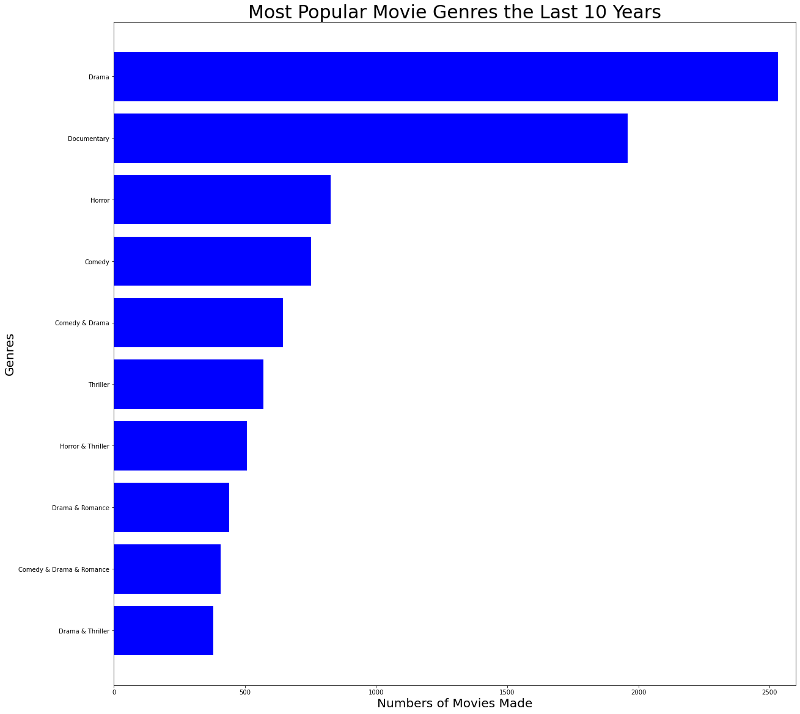
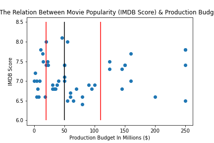
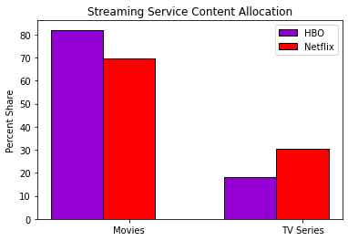
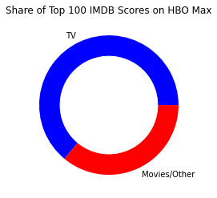

# Microsoft Studios

    Author: One Git Wonder

## Overview

 Microsoft is trying to penetrate into the film industry going against giants such as Netflix, Disney Plus, Amazon, and Hulu. 

The question is: What content should Microsoft create to give them an edge against these Tech Giants?

Below is our research and our findings that Microsoft can use as their first step into the industry. 

## Data

 Our research data was collected from these sources:

- Box Office Mojo 

- data.world

- IMDB 

- kaggle

- The Numbers

- TMDB 
    

## Methods

This project uses descriptive analysis. This includes: researching the most popular genre, finding the budget range for creating the content, and allocating the content between movies and tv series. This research is necessary in order to follow the trends. Microsoft needs this research in order to follow with the market trend. 
# Results   

The horiztonal bar chart below shows us the most popular movie genres that have been created the last 10 years.  Drama comes in at our top spot with Documentary and Horror following right behind it.

The chart below shows us the relationship between the movie popularity and production budget. If you take a look at the scatter plot, you can see the interquartile range (IQR), represented by the two red lines.

The red line on the left indicates the 25% quartile with a budget of $20M and the right red line indicating the 75% quartile with a budget of $110M.  

The black line in between the two, represents the middle most point with a budget of $50M.

Netflix divides its content into 70 percent movies and 30 percent TV series.

HBO Max divides its content into 80 percent Movies and 20 percent TV series.

Taking a closer look at HBO Max content,
we took the top 100 IMDB scores on the platform and found that 64% of the top 100 scores were from a TV series.
And 70% of the top 10 scores were from a TV series.

Our recommendation would be to allocate between 20-30% of the content to be in the TV series format.

## Conclusion
We came to 3 reccomendations from our study: 

1. Follow the trend with the Genres.
    - Drama
    - Documentary 
    - Horror
2. Set a budget between $20 and $110 million. 
3. Allocate the contents between movies and tv series. 

## Next Steps 
From our research we came with these insights that could improve the project at Microsoft: 
1. Investigate additional content allocation.
2. Explore the content rating (MA/R,PG-13). 
3. Do an analysis between Production Budget VS Gross Revenue

## For More Information
To see more of this research, please view the [presentation](https://docs.google.com/presentation/d/175_f02cngosxZtJbNJ8Qn9h1PP6t2uKREbUKqyATYsY/edit?usp=sharing) for more information. 

